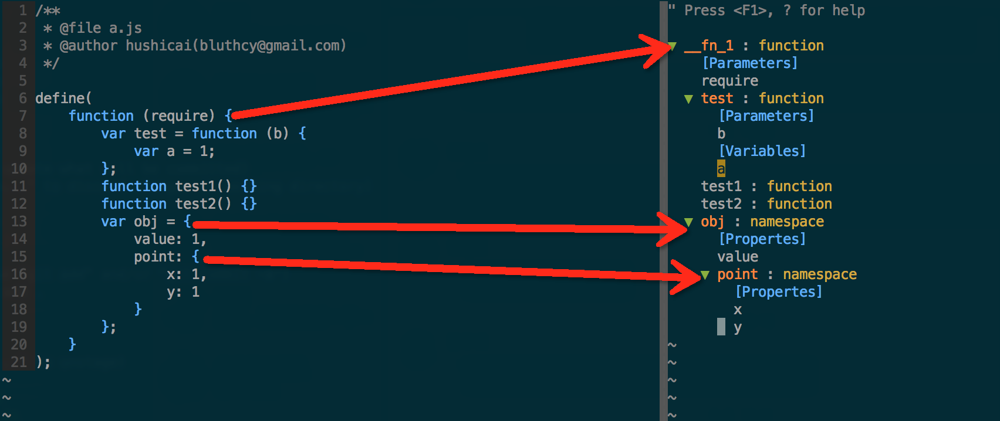

# tagbar-javascript.vim

javascript tags for tagbar.

## Usage

First, install `esctags` with npm:

```bash
npm install -g esctags
```

Then, install `tagbar-javascript.vim` with vundle:

```vim
Plugin 'tagbar-javascript.vim'
```

Now, enjoy it.

## Screenshots



## TODO

* constructor?
* prototype?
